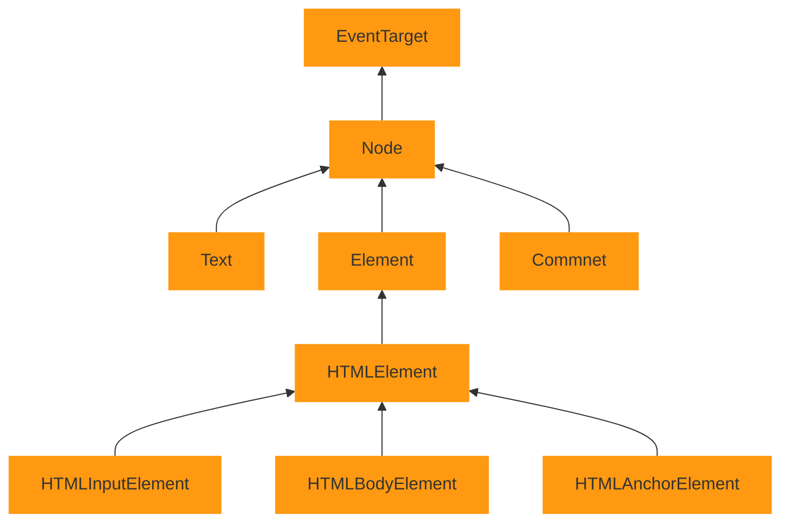

# Javascript

Notes on Javascript & ES6

## Summary

- Refernece vs value

## Contents

1. [JavaScript Introduction](#JavaScript-Introduction)
   1. [JavaScript Vs Java](#JavaScript-Vs-Java)
   2. [What makes JavaScript unique](#What-makes-JavaScript-unique)
   3. [Languages "over" JavaScript](#Languages-"over"-JavaScript)
   4. [Browser tools for JavaScript](#Browser-tools-for-JavaScript)
2. [JavaScript Fundamentals](#JavaScript-Fundamentals)

## References

* [Javascript.info](#https://javascript.info)
* freecodecamp
* Udemy FullStack Developer Course

## JavaScript Introduction

JavaScript ("JS" for short) is a full-fledged dynamic programming language that, when  applied to an HTML document, can provide dynamic interactivity on websites. It was invented by Brendan Eich, co-founder of the Mozilla project, the Mozilla Foundation, and the Mozilla Corporation.

### JavaScript Vs Java

| JavaScript                                                                                                                                                                   | Java                                                                                                                                                                                     |
| ---------------------------------------------------------------------------------------------------------------------------------------------------------------------------- | ---------------------------------------------------------------------------------------------------------------------------------------------------------------------------------------- |
| Object-oriented. No distinction between types of objects. Inheritance is through the prototype mechanism, and properties and methods can be added to any object dynamically. | Class-based. Objects are divided into classes and instances with all inheritance through the class hierarchy. Classes and instances cannot have properties or methods added dynamically. |
| Variable data types are not declared (dynamic typing, loosely typed).                                                                                                        | Variable data types must be declared (static typing, strongly typed).                                                                                                                    |
| Cannot automatically write to hard disk                                                                                                                                      | Can automatically write to hard disk.                                                                                                                                                    |
|                                                                                                                                                                              |                                                                                                                                                                                          |

[More Details of the object model](https://developer.mozilla.org/en-US/docs/Web/JavaScript/Guide/Details_of_the_Object_Model)

### What makes JavaScript unique

* Full integration with HTML/CSS
* Simple things are done simply.
* Support by all major browser and enabled by default.

### Languages "over" JavaScript

There are many languages which are transpiled (converted) to JavaScript before they run in the browser

* **CoffeeScript** : It introduces shorter syntax, allowing us to write clear and more precise code.
* **TypeScript** : Developed by Microsoft. It is concentrated on adding "strict data typing" to simplify the development and support of complex systems.
* **Dart** : Developed by google and runs in non-browser environments. To run in browser its need to be transpiled to JavaScript.

### Browser tools for JavaScript

1. The Web Console. Found in chrome and Firefox both
2. Scratchpad. `Shirt+F4` in firefox.

### Inserting JavaScript to HTML

In `index.html` file enter the following element on a new line just before the closing `</body>` tag:

```html
<script src="scripts/main.js"></script>
```

We can use `<script>` tag to insert JavaScript into any part of an HTML document.

```html
<!DOCTYPE HTML>
<html>

<body>

  <p>Before the script...</p>

  <script>
    alert( 'Hello, world!' );
  </script>

  <p>...After the script.</p>

</body>

</html>
```

#### Attributes of `<script>` tag

* `type` : The old HTML standard, HTML4 required as script to have a `type` usually it was `type="text/javascript"`. It is not required anymore.
* `language` : Not required anymore.


## Variables

Variables are declared using `let` keyword

```javascript
let message = 'Hello';

let user = 'John';
let age = 25;
let message = 'Hello';


// Other way to declare same variables

let user = 'John',
    age = 25,
    message = 'Hello';

...Or even in the "comma-first" style :

let user = 'John'
, age = 25
, message = 'Hello';
```

In old style, `var` was used instead of `let`

```Javascript
var myVar;

 //asigining variable
myVar = "Yahoo";

// Declaration and assiginment both

var myVar = "yahoo";
```

Semicolons:

* Required only we need to separate two statement in single line.
* Its a good practice.

> Further reading : Are semicolons must ?

#### `let` Vs `var`

1. variable declared with `var` keyword, has global scope while `let` has block level scope

2. Redeclaring the same variable, using let within the same function or block scope raises a `syntaxError`

3. This may also occure in switch statements because there is only one block

```javascript
   let x = 1;
   switch(x) {
     case 0:
       let foo;
       break;

     case 1:
       let foo; // SyntaxError for redeclaration.
       break;
   }
```

**4. Temporal DeadZone**

Unlike variables declared with [`var`](https://developer.mozilla.org/en-US/docs/Web/JavaScript/Reference/Statements/var#var_hoisting), which will start with the value `undefined`, `let` variables are *not* initialized until their definition is evaluated. Accessing the variable before the initialization results in a [`ReferenceError`](https://developer.mozilla.org/en-US/docs/Web/JavaScript/Reference/Global_Objects/ReferenceError). The variable is in a "temporal dead zone" from the start of the block until the initialization is processed.

```javascript
function do_something() {
  console.log(bar); // undefined
  console.log(foo); // ReferenceError
  var bar = 1;
  let foo = 2;
}
```

#### Variable Naming

1. The name must contain only letters, digits, or the symbols $ and _

2. The first character must not be a digit

3. When the name contains multiple words, `camelCase` is commonly used

4. Variables are case sensitive.

5. Non-English letters are allowed but not recommended.  

6. Can't use reserved words.
   
   Examples : `let, return, break, case, if, else` etc.

[List of reserved words](https://developer.mozilla.org/en-US/docs/Web/JavaScript/Reference/Lexical_grammar#Keywords)

#### An assignment without `use strict`

Normally, we need to define a variable before using it. But it the old times, it was technically possible to create a variable by a mere assignment of the value without using `let`. This still works now if we don't put `use strict` in our scripts to maintain compatibility with old scripts

```javascript
// note : no "use strict" in this example
num = 5;
alert(num); //5
```

This is a bad practice and would cause an error in strict mode:

```javascript
'use strict';
num = 5; // error: num is not defined
```

### Constants

To declare a constant (unchanging) variable, use `const` instead of `let:` Variables declared using `constant` are called "constant". They cannot be changed. An attempts to do so would cause an error

```javascript
const myBirthday = '18.02.1983';
myBirthday = '01.01.1983'; // error, can't reassing the constant !
```

#### Properties of const

- Cannot be reassigned.
- Block Scope
- It can be assign on the variable on declaration line.
- Primitive value.
- The property of a const object can be change but it cannot be change to reference to the new object
- The values inside the const array can be change, it can add new items to const arrays but it cannot reference to a new array.
- Re-declaring of a const variable inside different block scope is allowed.
- Cannot be Hoisted.
- Create only read only reference to value.

#### Uppercase constants

There is a widespread practice to use constants as aliases for difficult-to-remember values that are known prior to execution

Such constants are named using capital letters and underscores.

Like This :

```javascript
const COLOR_RED = '#F00';
const COLOR_GREEN = "#0F0";
const COLOR_BLUE = "#00F";
const COLOR_ORANGE = "#FF7F00";
```

Benefits of using uppercase :

* much easier to remember than hex code "#FF7FF00"
* less error prone
* readable

#### When should uppercase used

There are constants which values are **known prior to execution/page load** like colour codes. The values which are knows prior to page load are used in uppercase. and rest are used in normal case.

Variables may holds value that have different `data types`:

### Data Types

These six types are considered to be *primitives*. A primitive is not an object and has no methods of its own. **All *primitives are immutable***.

All primitives are **immutable**, i.e., they cannot be altered. It is important not to confuse a primitive itself with a variable assigned a primitive value. The variable may be reassigned a new value, but the existing value can not be changed in the ways that objects, arrays, and functions can be altered.


1. [Boolean](https://developer.mozilla.org/en-US/docs/Web/JavaScript/Reference/Global_Objects/Boolean) — true or false  
2. [Null](https://developer.mozilla.org/en/docs/Web/JavaScript/Reference/Global_Objects/null) — no value
3. bigint
4. [Undefined](https://developer.mozilla.org/en-US/docs/Web/JavaScript/Reference/Global_Objects/undefined) — a declared variable but hasn’t been given a value
5. [Number](https://developer.mozilla.org/en-US/docs/Web/JavaScript/Reference/Global_Objects/Number) — integers, floats, et
6. [String](https://developer.mozilla.org/en-US/docs/Web/JavaScript/Reference/Global_Objects/String) — an array of characters i.e words
7. [Symbol](https://hacks.mozilla.org/2015/06/es6-in-depth-symbols/) — a unique value that's not equal to any other value

Everything else is an **Object** type.

There are constructors to create these types Like -

- Boolean()

- Number()

- Symbol()

Although we need not to use these constructors to create primitives excepts `Symbol`

#### Type Conversions

In JavaScript, most of the time, operators and functions automatically convert the values given to them to the right type.

There are some built in function which can be used to convert type :

##### ToString

```javascript
let value = true;
alert(typeof value); // boolean

value = String(value); // now value is a string "true"
alert(typeof value); // string
```

##### ToNumber

Numerical conversion happens in mathematical functions and expression automatically.

```javascript
alert( "6" / "2" ); // 3, strings are converted to numbers
```

#### Explicit conversion

```javascript
let str = "123";
alert(typeof str); // string

let num = Number(str); // becomes a number 123

alert(typeof num); // number
```

Numeric conversion rules:

| Value            | Becomes..                                                                                                                                                                   |
| ---------------- | --------------------------------------------------------------------------------------------------------------------------------------------------------------------------- |
| `undefined`      | `NaN`                                                                                                                                                                       |
| `null`           | 0                                                                                                                                                                           |
| `true and false` | `a` and `0`                                                                                                                                                                 |
| `string`         | Whitespaces from the start and end are removed. If the remaining string is empty, the result is `0`. Otherwise, the number is “read” from the string. An error gives `NaN`. |

Explicit conversion is usually required when we read a value from a string-based source like a text form but expect a number to be entered.

If the string is not a valid number, the result of such a conversion is `NaN`.

##### Addition and string

Almost all mathematical operations convert values to numbers. A notable exception is addition `+`. If one of the added values is a string, the other one is also converted to a string.

Then, it concatenates (joins) them:

```javascript
alert( 1 + '2' ); // '12' (string to the right)
alert( '1' + 2 ); // '12' (string to the left)
```

##### ToBoolean

It happens in logical operations (later we’ll meet condition tests and other similar things) but can also be performed explicitly with a call to `Boolean(value)`.

The conversion rule:

- Values that are intuitively “empty”, like `0`, an empty string, `null`, `undefined`, and `NaN`, become `false`.
- Other values become `true`

```javascript
alert( Boolean(1) ); // true
alert( Boolean(0) ); // false

alert( Boolean("hello") ); // true
alert( Boolean("") ); // false
```

Note : The string with zero "0" is `true`

Some languages (namely PHP) treat `"0"` as `false`. But in JavaScript, a non-empty string is always `true`.

```javascript
alert( Boolean("0") ); // true
alert( Boolean(" ") ); // spaces, also true (any non-empty string is true)
```

## Comment

```Javascript
/*
This is multiline comment
/*

// This is single line comment.
```

## Operators

| Operator       | Symbol |
| -------------- | ------ |
| Addition       | `+`    |
| Subtraction    | `-`    |
| Multiplication | `*`    |
| Division       | `/`    |
| Assigment      | `=`    |
| Equality       | `===`  |
| Not equal      | !=     |

### Conditionals

```Javascript
var iceCream = 'chocolate';
if (iceCream === 'chocolate') {
  alert('Yay, I love chocolate ice cream!');
} else {
  alert('Awwww, but chocolate is my favorite...');
}
```

### switch cases

```javascript
switch(num) {
  case value1:
    statement1;
    break;
  case value2:
    statement2;
    break;
...
  case valueN:
    statementN;
    break;
}

// Example

function switchOfStuff(val) {
  var answer = "";
  switch (val){
    case "a":
      answer = "apple";
      break;
    case "b":
      answer = "bird";
      break;
    case "c":
      answer = "cat";
      break;
    default:
      answer = "stuff";
  }
  return answer;  
}

// Change this value to test
switchOfStuff(1);

/*
Common Code block

Write a switch statement to set answer for the following ranges:
1-3 - "Low"
4-6 - "Mid"
7-9 - "High"
*/

function sequentialSizes(val) {
  var answer = "";
  // Only change code below this line
  switch (val){
    case 1:
    case 2:
    case 3:
      answer = "Low";
      break;
    case 4:
    case 5:
    case 6:
      answer = "Mid";
      break;
    case 7:
    case 8:
    case 9:
    answer = "High";
  }
  // Only change code above this line  
  return answer;  
}

// Change this value to test
sequentialSizes(1);
```

## Object

In contrast to 'primitives' which store only signle value, objects are used to store keyed collection of various data and more complex entities 

An object can be created with figure brackets `{…}` with an optional list of *properties*. A property is a “key: value” pair, where `key` is a string (also called a “property name”), and `value` can be anything.


There are two that are the main ones you’ll use for your own structures:

- [Object](https://developer.mozilla.org/en-US/docs/Web/JavaScript/Reference/Global_Objects/Object)
- [Array](https://developer.mozilla.org/en-US/docs/Web/JavaScript/Reference/Global_Objects/Array)

There are many other objects too just to list a few:

- Function
- Boolean
- Symbol
- Error
- Number
- String
- RegExp
- Math
- Set

Note - 

Notice some of these were on the primitive list too, but don’t confuse them. These act as *constructors* to create those types. i.e `Boolean('a') // true`

- All primitive values are immutable
- Be aware of type coercion
- There is no static typing i.e `int num = 5`
- The JavaScript engine decides what type it is
- 

### Selectors

```Javascript
var h1 = document.querySelector("h1");

//Update color of h1

h1.style.color = "Red"
```

#### document object Model

Top level object of HTML page

IMP Methods

```javascript
document.getElementById()

document.getElementsByClassName()

//Returns node object. which is not an array. Its light weight array.

document.getElementsByTagName()

document.querySelector("#highlight"); //Query selector returns only very first match.

document.querySelectorAll('li') // Returns all object.

document.textContent("p") //Retuns only text inside tag, not any tag inside the selected tag.

document.innerHtml("p") //Return everything including tags.

.getAttribut()

document.body.classList.toggle("classname") //Toggle class, remove class if already there.
```

## Advance Javascript

### JavaScript vs ECMAScript

JavaScript is standradized at [Ecma International](js_InsideBrowser.png) `(European Association for Standaradizing Information and Communication Systems`. ECMA was formerly an acronym for the `European Computer Manufactrers Association`. The standradized version of JavaScript, called ECMAScript, behave the same way in all applications that support the standard.

#### ECMA-262

The ECMAScript standard is documented in the ECMA-262 specification.

This is a standard published by Ecma International. It contains the specification for a general purpose scripting language.

It is a name of the standard, it presents the scripting language specification.

> JavaScript is a general pupose scripting laungauge that conforms to the ECMAScript specification. ECMAScript specification tells us how to create a scripting laungage. But JavaScript Documentation let us know how to program (Use) in javascript.

#### DOM

The ECMAScript specification does not describe the Document Object Model (DOM), which is standradized by the `Word Wide Web Consortium (W3C)` and/or `Web Hypertext Application Technology Working Group (WHATWG)`.

The DOM defines the way in which HTML document objects are exposed to your script.

### JavaScript Engine

A JavaScript engine is a program or enterpreter which execute JavaScript Code. It is commonly used in in web. Also known as `javascript interpreter`

| Engine               | Developed By       | Used By                                      |
| -------------------- | ------------------ | -------------------------------------------- |
| V8                   | Google             | OpenSource, Google Chrome and Node.js        |
| SpiderMonkey         | Netscape Navigator | The first Javascript engine, used by firefox |
| Rhino                | Mozilla Foundation | Developed entirely in Java                   |
| Chakra (JavaScript0) | Microsoft          | Edge                                         |
| Chakra (JScript9)    | Microsoft          | Internet Explorer                            |

ECMAScript and Browser Support

If new ECMAScript specification has been released it doesn't necessarily mean that every Engine will start support all the Features/updates.

We can find the ECMAScript compatibility table [here](http://kangax.github.io/compat-table/es6/)

JavaScript Runtime:

#### Inside of JavaScript engine

In this section we will understand about following things

* Memory Heap
* The Call Stack
* The Runtime
* Concurrency & the Event Loop
* Engine WebAPI
* Callback Queue
* Ashynchronous

Basic Architecture of Browser


> References:
> 
> * <https://blog.sessionstack.com/how-does-javascript-actually-work-part-1-b0bacc073cf>
> * <https://www.youtube.com/watch?v=8aGhZQkoFbQ>

### Variabe

JavaScript, Before ECMAScript 2015

* **Global Variable :** When we declare a variable outside of any function. It is available to any other code in the current document.
* **Local Variable** : Variable declared within a function. Only available to function.

Example:

```JavaScript
 // Gloabl variable

 var x = 'outside';

 function bar() {
 // declaring variable does not access global variable.
   var x = 'Inside'
   console.log(x);
 }

 bar() // inside
 console.log(x) // outside

 // ----------------- Example 2

 var x = 'outside'
 function bar() {
 // Assiging vairable, It modify global variable.
   x = 'Inside'
   console.log(x);
 }

 bar() // inside
 console.log(x) // inside

 // ----------- Example 3
 if (true) {
   var x = 5;
 }
 console.log(x);  // x is 5
```

* If we do not declare variable inside function, It becomes global variable and can be accessed globally.

* "use strict" on top of the file to use strict mode in java script which stop to use global variable accidently.

* **Lexical Scope :** A scope can be nested inside another scope, just like if a clown at a birthday party blow up one balloon inside another balloon. If one scope is nested inside another, code inside the innermost scope can access variables from either scope.
  
  > Lexical scope rules say that code in one scope can access variables of either that scope or any scope outside of it.

Example :

```javascript
function outer() {
    var a = 1;
    function inner() {
        var b = 2;
        // we can access both `a` and `b` here
        console.log( a + b ) ==3
    }
    inner();
    // we can't access b here. Only a is accessible
    console.log(a);
}
```

#### Variable hoisting

In JavaScript we can refer to a variable declared later, without getting an exception. This concept is known as `hoisting` and the variable is `hoisted`.

However, variables that are hoisted return a value of undefined. So even if you declare and initialize after you use or refer to this variable, it still returns `undefined`.

Example:

```javascript
console.log(y); //ReferenceError: y is not defined

console.log(x); // undefined

console.log(x === undefined); // true
var x;
x = 3;

console.log(x); //3
/**
 * Example 2
 */
var myvar = 'my value';

(function() {
  var myvar;
  console.log(myvar); // undefined
  myvar = 'local value';
})();
```

Conclusions :

* `var` are **function-scoped**. Scope is limited to the function.
* `var` are not **Block-scoped**. Scope is not limited to the block it was defined in.

Problem with var:

```javascript
var i = 0
if (true) {
  var i = 1;
}
console.log(i); // 1
```

`i` was still in the "global scope" within the if block. i's value was overwritten, which may have not been the intention.

To overcome global problem in `ES6` let & const keywords were introduces.

#### let

`let` variables are block-scoped. Specific scope = less mistakes.

```javascript
let i = 0;
if (true) {
  let i = 1;
}

console.log(i); //0
```

Conclusion :

* in `function-scope` scope `let` behave same as var.
* in `if` scope `let` behave like var behave in `function scope.`
* `let` variables are block-scoped. It behave same whether it is funciton block or if block.

#### const

`const` restricts over-writing variables. It prevents re-assignment.

```javascript
const i = 0;
i = 1; // TypeError: Assignment to constant variable.
```

`const` doesn't let you declare a variable without assigning its.

```javascript
const i; // SyntaxError: Missing initializer in const declaration
```

`const` is `block scoped` like `let`

```javascript
if (true) {
  const i = 0;
}
console.log(i); // ReferenceError: i is not defined
```

`const` does allow variable mutation(only objects/arrays are mutable in JS)

Array Mutation:

```javascript
const a = [1];
const b = a;
console.log(a === b); // true
b.push(2);
console.log(a === b); // true
console.log(a); /// [ 1, 2 ]
```

### Functions

Example

```Javascript
// Function definition

function multiply(num1,num2) {
  var result = num1 * num2;
  return result;
}

// Function call

multiply(4, 7);
multiply(20, 20);
multiply(0.5, 3);
```

#### Function Scope

```javascript
function foo() {
    bar();
    console.log('inside foo');
    function bar() {
        console.log('insde bar');
    }
}

foo();

// bar can only be called inisde foo any where not outside of foo()
bar(); //ReferenceError: bar is not defined
```

#### Function Declaration vs Function Expression

```javascript
//Function declaration
function foo(){
  console.log('bar')
}
```

```javascript
// function expression
var foo = function(){
  console.log('bar')
};
```

Note : **Function Expressions** end with semicolons, **declarations** do not.

#### Function Hoisting

Function Declarations are always hoisted to the top of their scope. Means unlike shell script we can declare function anywhere in scope and and can be called from anywhere without getting undefined error.

Example -

```javascript
// Calling function before decleration.

foo('bar'); //bar

fuction foo(x){
  console.log(x);
}
```

Function express defitions are not hoisted. Just like variable declaration, declaration is done but assignment is not done(hoisted). So we can't call function.

```javascript
bar('foo') //TypeError: bar is not a function

var bar = function(x) {
    console.log(x);
}
```

#### Read More

* TOREAD - Are semicolons (;) must ?
* TOREAD - [Performance Mistake](https://hackernoon.com/3-javascript-performance-mistakes-you-should-stop-doing-ebf84b9de951)

In ECMAScript 2015, `let (const)` does not hoist the variable to the top of the block. Referencing the variable in the block before the variable declaration results in a `ReferenceError`.

```Javascript
console.log(x); // ReferenceError
let x = 3;
```

#### First Order Function vs Higher order Function

> A higher order function is a function that takes a function as an argument, or returns a function

In contrast to `higher order functions`, first order function don't take a function as an argument or return a function as output.

`Callback function` : Function which is called from some other function.

`Higher Order Function` : It is the function which call callback function.

```javascript
// callback

function cb() {
 console.log("Comming from callback");
}

function higherOrder(fn){
 console.log("Calling callback");
 fn();
}

higherOrder(cb);
```

#### What are callbacks used for

* Advance Array methods

* Browser events

* AJAX Request

* React Development

#### Arrow functions

Arrow functions – also called “fat arrow” functions, from CoffeeScript ([a transcompiled language](http://blogs.msdn.com/b/cdnstudents/archive/2013/09/17/visual-studio-tips-for-javascript-coders-try-coffeescript.aspx?WT.mc_id=16547-DEV-sitepoint-article83)) — are a more concise syntax for writing function expressions. They utilize a new token, `=>`, that looks like a fat arrow. Arrow functions are anonymous and change the way `this` binds in functions.

```javascript
// Regular function

function funcName(params) {
  return param + 2;
}

funcName(5); //7

// Arrow function

var funcName = (param) => params + 2 ;

funcName(5); //7
```

##### 1. Shorter Syntax

Syntax :

> (parameters) => { statements }

* If we have no parameters(argument), we express an arrow function like this:

> () => { statement }

```javascript
let sayHi = () => alert("Hello world");
sayHi();
```

Note - In case of no argument empty parentheses are must.

* If we have only one parameter, the opening parenthesis are optional :

> parameter => { statements }

```javascript
let double = n => n * 2;
alert(double(3)); //6
```

* If you are returning an expression, you remove the brackets:

```javascript
parameter => expression

//or

function testFunc (parameters) {
   return expression;
}
```

* Multiline arrow function
  
  ```javascript
  let sum = (a, b) => {
      let result = a + b;
      return result;
      alert(sum(1,2)); //3
  }
  ```

##### 2. No binding of this

Unlike a regular function, an arrow function does not bind `this`. Instead `this` is bound lexically (`this` keeps its meaning from its original context).

References

* https://github.com/getify/You-Dont-Know-JS/blob/master/scope%20&%20closures/README.md#you-dont-know-js-scope--closures
* https://www.sitepoint.com/es6-arrow-functions-new-fat-concise-syntax-javascript/
* https://developer.mozilla.org/en-US/docs/Web/JavaScript/Reference/Functions/Arrow_functions
* https://codeburst.io/javascript-arrow-functions-for-beginners-926947fc0cdc
* https://medium.freecodecamp.org/when-and-why-you-should-use-es6-arrow-functions-and-when-you-shouldnt-3d851d7f0b26

### 'this' keyword

* A reserved keyword in JavaScript

* Usually determinded by how a function is called (What we call 'execution context')

* Can be determined using four rules (gloal, object/implicit, explicit, new)

#### Global Object

Every global variable declared in browser is attached to `window` object. In global context `this` refer to `window` object.

```javascript
console.log(this) // window
```

This inside of a function 

```javascript
function test() {
    return this;
}

test(); // window
```

The keyword `this` returns to global object. This happens because the keyword `this` is not inside of a declared object.

In case of `strict mode` this will be `undefined`.

#### Declared Object

Keyword `this` inside Declared Object refers to closest Parent  Object, the method is called on. 

```javascript
var person = {
    first: 'Anil',
    last: 'Maurya',
    full: function(){
        console.log(this.first + ' ' + this.last);
    }
}

person.full();
// 'Anil Maurya'

//FIXME: arrow function behave diffrently 
```

Value of `this` is set to the closest parent object the method is called on:

```javascript
var person = {
    first : 'first',
    last: 'last',
    full: function() {
        console.log(this.first + ' ' + this.last);
    },
        personTwo: {
            first: 'person',
            last: 'two',
                full: function() {
                    console.log(this.first + ' ' + this.last);
                }
        }
};

person.full() // 'first last'

person.personTwo.full() // 'person two'
```

#### The 'new' Keyword and 'this'

When the `new` keyword is used(a constructor), `this` is bound to the new object being created.

Example :

```javascript
function Car(make, model) {
    this.make = make;
    this.model = model;
};
```

In above example `this` is bound to the global object.

```javascript
var myCar = new Car('Ford', 'Escape');

console.log(myCar);

// Car {make: "Ford", model: "Escape"}
```

Here `this` refer to `myCar` object.


#### Conclusion

1. The value of `this` is usually determined by a functions **execution context**.
2. In the global scope, `this` refers to the global object (the window object).
3. When the `new` keyword is used(a constructor), `this` is bound to the new object being created.
4. We can set the value of `this` explicitly with `call()`, `bind()`, and `apply()`
5. Arrow Functions don’t bind `this` — instead `this` is bound lexically (i.e. based on the original context)

#### References

> * https://codeburst.io/javascript-the-keyword-this-for-beginners-fb5238d99f85

### Closures

#### Background

Generally functions are stateless.

```javascript
function Counter() {
    var counter = 0;
    counter++;
    console.log(counter);
}

Counter(); //First Time 
// log  1
Counter(); //Second Time
// log 2
```

In above example, every time we call `Counter()` function every time it logs 1. Value of variable `counter` is not saved. We can say that function is not maintaining it state.

We could obtain desired result by declaring counter globally. 

```javascript
var counter = 0;
function Counter() {
    counter++;
    console.log(counter);
}

counter();
//log 1

counter();
//log 2
```

Problem with creating variable Globally :

This variable is accessible to all other functions, which can cause problem. One of the rule of good programming says - **Modules, Functions, methods should be self contained. They should be isolated self contained.**

This is also known as Global Variable pollution.

Closures help us to achieve isolated, stateful function. Closures is functions inside other function. A function **Encloses** other function.

```javascript
function Counter() {
    var counter = 0;
    //this function is ENCLOSED inside Counter()
    var Increment = function () {
        counter++;
        console.log(counter);
    }
    return {
        Increment
    }
}
var x = Counter(); //First time
x.Increment(); //1
x.Increment(); //2

var x1 = Counter(); // Second time
x1.Increment();
x1.Increment();
```

#### Definition

A Closure is an inner function that has access to the outer (enclosing) function's variables - scope chain. The closure has three scope chains :

1. It has access to its own scope.
2. It has access to the outer function's variables,
3. It has access to the global variables.

We can say - Closures are nothing but stateful functions. 

#### lexical scope

Java script has lexical scope, which means variable defined in upper scope is automatically available to inner scope. We need not to pass it.

> A closure is the combination of a function and the lexical environment within which that function was decleared.

#### Rules and Side Effects

1. Inner function still has access to the outer function's variables even after the outer function has returned. Therefore, we can call the inner function later in our program.
   
   ```javascript
   function celebrityName(firstName) {
       var nameIntro = 'This celebrity is ';
       //this inner function has access to the outer function's variables, including the paramert
   
       function fullName(lastName) {
           return nameIntro + firstName + " " + lastName;
       }
       return fullName;
   }
   
   var mjName = celebrityName("Michael"); // at this juncture, the celebrityName out function has returned.
   
   // The closure (lastName) is called here after the outer function has returned above.
   
   // Yet, the closure still has access to the outer function's variable's and parameter
   
   mjName("Jackson"); //this celebrity is Michael Jackson.
   ```

2, Closures store references to the outer function's variables:

Closures do not store the actual value, if value of the outer function's variable changes before the closure is called. closure's values also get changed.

```javascript
function celebrityID() {
    var celebrityID = 999;
    // We are returning an object with some inner functions
    // All the inner functions have access to the outer function's variables
    return {
        getID : function() {
            // This inner function will return the UPDATED celebrityID variable
            // It will return the current value of celebrityID, even after the changeTheID function changes it
            return celebrityID;
        },
        setID : function(theNewID) {
            // This inner function will change the outer function's variable anytime
            celebrityID = theNewID;
        }
    }
}

var mjID = celebrityID(); // At this juncture, the celebrityID outer function has returned.

mjID.getID(); //999
mjID.setID(567); 
mjID.getID(); // 567
```

3. Closure Gone Awry (Awar - away from usual or expected aims.)
   
   Because closures have access to updated values of the outer function's variables, they can also lead to bugs when the outer function's variable changes with a for loop
   
   ```javascript
   function celebrityIDCreator(theCelebrities) {
       var i;
       var uniqueID = 100;
       for (i = 0; i< theCelebrities.length; i++){
           theCelebrities[i]["id"] = function() {
               return uniqueID + i;
           }
       }
       return theCelebrities;   
   }
   ```
   
   var actionCelebs = [{name: "Stallone", id:0}, {name: "Cruise", id:0}, {name : "Willis", id: 0}];
   
   var createIdForActionCelebs = celebrityIDCreator(actionCelebs);
   
   var stalloneID = createIdForActionCelebs[0];

```
   In this example, by the time the anonymous functions are called, the value of i is 3. The number 3 was added to the uniqueID to create  103 for ALL the celebritiesID. So every position in the returned array get id = 103, instead of the intended 100, 101, 102.

   The reason this happened was because, the closure has access to outer function's variables by reference not by value.  So till closure (anonymous function in this example) get called, ID is set to 103 by for loop.

   To fix this side effect (bug) in closures, we can use an Immediately Invoked Function Expression (IIFE)

```javascript
function celebrityIDCreator(theCelebrities) {
    var i;
    var uniqueID = 100;
    for (i = 0; i< theCelebrities.length; i++){
        theCelebrities[i]["id"] = (function() {
            return uniqueID + i;
        })();
    }
    return theCelebrities;   
}


var actionCelebs = [{name: "Stallone", id:0}, {name: "Cruise", id:0}, {name : "Willis", id: 0}];

var createIdForActionCelebs = celebrityIDCreator(actionCelebs);

var stalloneID = createIdForActionCelebs[0];
```

### IIFE

Immediately Invoked Function Expression). Sometime we need functions to be invoked immediately

```javascript
function speak() {
    console.log("Hello");
}
speak();
```

Same thing can be done using **IIFE**

```javascript
(function () {
    console.log("Hello");
})();
```

The **IIFE** is just an anonymous function that is wrapped inside of a set of parentheses and called immediately.

We can pass arguments into the IIFE 

```javascript
var foo = "foo";

(function (innerFoo) {
    // Outputs: "foo"
    console.log(innerFoo);
})(foo);
```

> An IIFE protects a module’s scope from the environment in which it is placed.

#### The Parentheses

Why  we need to wrap the IIFE function inside of parentheses ? 

By Wrapping the anonymous function inside of parentheses, the JavaScript parser knows to treat the anonymous function as a function expression instead of a function declaration. A function expression can be called immediately by using a set of parentheses, but a function declaration can not be.

#### Benefit of IFFE

##### 1. Data Privacy

Any variables declared within the IIFE cannot be accessed by the outside world. Same thing can be done in regular functions but in naming a function, increases the possibility of name collisions.

The anonymous function within **IIFE is a function expression and is not being assigned to a global variable**, no global property is being created, and all of the properties created inside of the function expression are scoped locally to the expression itself.

##### 2. Reduce scope lookups

A small performance benefit of using IIFE’s is the ability to pass commonly used global objects (window, document, jQuery, etc) to an IIFE’s anonymous function, and then reference these global objects within the IIFE via a local scope.

**Note**: JavaScript first looks for a property in the local scope, and then it goes all the way up the chain, last stopping at the global scope. Being able to place global objects in the local scope provides faster internal lookup speeds and performance.

```javascript
// Anonymous function that has three arguments
function(window, document, $) {

  // You can now reference the window, document, and jQuery objects in a local scope

}(window, document, window.jQuery); // The global window, document, and jQuery objects are passed into the anonymous function
```

##### 3. Minification Optimization

A minifier is able to reduce the name of each global object to a one letter word, as log as you don't already have a variable of the same name. So in case in IIFE Minification become better.

##### 4. Readability Issue

If you have a lot of JavaScript code inside of an IIFE, and you want to find the parameters that you are passing into an IIFE, then you need to scroll all the way to the bottom of the page

#### References

- https://www.youtube.com/watch?v=FYrtnS3X_Lw

- http://javascriptissexy.com/understand-javascript-closures-with-ease/

- https://medium.freecodecamp.org/lets-learn-javascript-closures-66feb44f6a44

- https://medium.com/javascript-scene/master-the-javascript-interview-what-is-a-closure-b2f0d2152b36

- http://gregfranko.com/blog/i-love-my-iife/

- https://j11y.io/javascript/iife-argument-madness/

#### forEach function

forEach(array, callback(str, index, array)) : here callback gets 3 parameters, str, index, array

#### setTimeout & setInterval

#### Event Loop and the Queue

javaScript is Single threaded. Code execution is linear. Code that is running cannot be interrupted by something else going on in the program.

### Pure Functions

A **pure function** is a **deterministic function**. This means when a same input is passed every time, the function will return same output. In mathematical terms it is nothing but a **well defined function.**

### Memoization

> Memoization is optimization technique that speeds up application by storing the result of expensive function call and returning cached result when the same input is supplied again. 

Example : A fabonacci sequence, without memoization

```javascript
function fibonacci(n) {
    if (n <= 1) {
        return 1
    }
    return fibonacci(n - 1) + fibonacci(n - 2);
}
```

A fabonacci sequence, with memoization

```javascript
function fibonacci(n,memo) {
    memo = memo || {}
    if (memo[n]) {
        return memo[n]
    }
    if (n <= 1) {
        return 1
    }
    return memo[n] = fibonacci(n - 1, memo) + fibonacci(n - 2, memo)
}
```

### Promise Basic

### Deep Camparision vs Shallow camparision

### AJAX

```
[A]synchronous
[J]avaScript
[a]nd
[X]ML
```

Its Not
​    1. A Library
​    2. A Framework
​    3. A Technology

AJAX is :

 an approach. With AJAX, websites can send and request data from a server in the background without disturbing the current page.

Data Formats

API's don't respond with HTML. API's respond with pure data, not structure.
They use more efficient data formats like XML and JSON

JSON (Java Script Object Notation)
Represnt data in key, value formats. Looks like java script object.

Making Requests with JavaScript

1. XMLHTTP Request (XHR)
2. Fetch API
3. 3rd Party Libraries
   jQuery & Axios

```Javascript
 // XMLHTTP Request example.

 var XHR = new XMLHttpRequest();

 //handle event
 XHR.onreadystatechange = function(){
     if(XHR.readyState = 4){
         if ( XHR.status == 200){
             console.log(XHR.responseText);
         }else{
             console.log("Threre was a problem!");
         }
     }
 }

 XHR.open("GET", "https://api.github.com/zen");
 XHR.send();
```

First AJAX "App"

```java
// Change Image on button click in html

var btn = document.querySelector("#btn");
var img = document.querySelector("photo");

// Listen for clicks
btn.addEventListener("click", function(){
    var XHR =new XMLHttpRequest();

    XHR.onreadystatechange = function(){
        if(XHR.readyState == 4 && XHR.status == 200){
            //XHR.responseText return string, convert it to JSON
            var url = JSON.parse(XHR.responseText).message;
            img.src = url;
            // console.log(data.message)
        }
    }
})

XHR.open("GET", "https://dog.ceo/api/breads/image/random");
XHR.send();
```

FETCH API & promises

```java
  var url = "https://api.coindesk.com/v1/bpi/currentprice.json";

  fetch(ur)
  // handle promise.
  .then(function(response){
          console.log(response);
          return response.json() //Return promise again.
  })
  // handle json promise.
  .then(function(data){
      console.log(data.bpi.EUR.rate);
  })
```

Fetch Options

```java
var url = "";
fetch(url,  {
    method: 'POST'
    body : JSON.stringify({
        name: 'blue',
        login: 'bluecat',
    })
})
..............
..............
..............
```

Fetch Error Handeling

```java
fetch(url)
.then(function(request){
    // handle error related to response.
    if(!request.ok){
        throw Error(request.status);
    }
    return request;
 })
 .then(function(request){
     console.log(request)
 })

// catches network related error
 .catch(function(error){
     console.log("error")
 })
```

The Problem with fetch
 IE doesn't support fetch.

#### AJAX with jQuery

$.ajax(data)
.done() //Execute if success
.fail() // Execute if failes.

```java
$.ajax({
    method: 'GET',
    url: .
})
```

#### Ajax shorthand methods

$.get("test.php")
.done(function(data){
​    console.log(data);
})

$.post()

$.getJSON()

### AXIOS

Simple & light weight library for making ajax request. Like JQuery

Syntax:

axios.get(url)
.then(function(res){
​    console.log(res.data);
})
.catch(function(e){
​    console.log(e);
})

ERROR Handling in Axio

### Testing with Jasmine

Writing test in browser

### Array Methods in JavaScript

#### forEAch Method

var arr = [1, 2, 3]

arr.forEach(function(value, index, array){
​    console.log(value, index, array)
})

#### Map method

Map iterate array same as forEach and returns an array.
map returns a new array of the SAME length of passed array

arr.map(function(value){
​    return value * 3; // We must return something.
})

// it retuns new array with each element multiplied by 3.

#### Filter method

- Create a new array
- iterate through an array
- Runs a callback function on each value in the array
- if the callback function returns true, that value will be added to the new array
- if the callback function returns false, that value will be ignoredored from the new array
- callback function must return true/false

```java
var arr = [
{name: "abc"},
{name: "def"},
{name: "lmno"}
]

arr.filter(function(value, index, array){
    return value.name.length > 3;
})
```

Note - Parameters passed to callback are not mandatory, only order is, we can pass parameters as required.

arr.filter(function(value){
​    return value.name.length > 3;
})

#### some method

- Iterates through an array
- Runs a callback on each value in the array
- If the callback returns true for at least one single value, returns true
- Otherwise, returns false

Note - method always return boolean value.

```java
var arr = [1, 2, 3];

arr.some(function(value, index, array){
    return value < 2;
})

// true
```

#### Every Method

- Iterates through an array
- Runs a callback on each value in the array
- If the callback returns false for any single value, returns false
- Otherwise, return true

Note - The result of the callback will ALWAYS be a  boolean

```java
var arr = [-1, -2, -3];

arr.every(function(value, index, array){
    return value < 0 ;
});

// returns rue


arr.every(function(value, index, array){
    return value > 2;
});

// returns false
```

Using every in a function

```java
function allLowerCase(str){
    return str.split('').every(function(value){
     return value === value.toLowerCase();    
    });
}

allLowerCase('this is really nice'); //true
allLowerCase('this is Really nice'); //false
```

#### Reduce Method

- Accepts a callback function and an optional second parameter
- Iterates through an array
- Runs a callback on each value in the array
- The first parameter to the callback is either the first value in the array or the optional second parameter
- The first parameter to the callback is often called "accumulator"
- The returned value from the callback becomes the new value of accumulator

Note - Whatever is returned from the callback function, becomes the new value of the accumulator!

Syntax :

Array.reduce(function(accumulator, value, index, array){
​     
}, optional second parameter-Become accumulator);

:: TODO - Fix Me


### NPM

Extra tutorial to try:

Advance JavaScript.
https://www.youtube.com/watch?v=s6SH72uAn3Q&list=PL7pEw9n3GkoW5bYOhVAtmJlak3ZK7SaDf

### OOPS (Object Oriented Programming System)

Object means a real-world entity such as a pen, chair, table computer etc. **Object-Oriented Programming** is a methodology or paradigm to design a program using classes and objects.

Principles of Object Oriented Programming :

- **Abstraction** : Show only what is necessary. Hiding details and showing functionality is known as abstraction.
- **Encapsulation** :- Hide complexity 
- **Inheritance** : Parent Child relations
- **Polymorphism :** Depending on situation different behaviour 

OOPS in JavaScript

```javascript
function Customer() {
    //Make all the things private
    //Encapsulation
    var _CustomerName = "";
    var _CustomerCode = "";
    var _Validate = function() {
        _DbConnect();
    }
    var _DbConnect = function() {

    }
    //abstraction -- Show only what required.
    retrun {
        CustomerName: _CustomerName,
        CustomerCode: _CustomerCode,
        Validate: _Validate
    }
}

var cust = new Customer();
cust.CustomerCode = "1001";
cust.Validate();
```

### Creating Class in Javascript

```javascript
"use strict"
class User{
    constructor(username, email, passwrod){
        //constructor method execute on instanciation
        // Assign values to class properties
        this.username = username;
        this.email = email;
        this.password = password;
    }

    //Regular method
    register(){
        console.log(this.usernaem +' is registered now.')
    }
}

let bob = new User('bob', 'bob@email.com', '1234')

bob.register()
// bob is registred now.
```

### Static Method

Static methods belongs to class instead of instance of the class. Means we can call static method without instantiation of class.

- The static keyword is used to declare a static method.
- The static method can be of any name.
- A class can contain more than one static method.
- If we declare more than one static method with a similar name, the JavaScript always invokes the last one.
- The static method can be used to create utility functions.
- We can use this keyword to call a static method within another static method.
- We cannot use this keyword directly to call a static method within the non-static method. In such case, we can call the static method either using the class name or as the property of the constructor.

### Style Guide (Coding Style)

See you later..

## JavaScript DOM

Document Object Model or DOM is an application programming interface for manupulating HTML and XML documents. 

The DOM represents a document as a tree of nodes. It provides api that allows us to add, remove, and modify parts of the document effectively.

Hierarchy of Nodes

Document

- HTML
  
  - head
    
    - title
      
      - text
  
  - body
    
    - h1
      
      - text

### Node and Element

A node is a generic name of any object in the DOM tree. It can be any built in DOM element such as the document. 

An element is a node with a specific node type. Node.ELEMENT_NODE, which is equal to 1.



Element Selection

* getElementById(id)

* getElementsByName()

* getElementsByTagName()

* getElementsByClassName()

* querySelector()

* querySelectorAll()

* createElement(htmlTag)

CSS

    document.getElementById('id').style.color = 'red'

DOM Events

    `<h1 onClick="function">Click Me</h1>`

or

`document.getElementById('myBtn').addEventListener('click', functionName)`

**DOM Navigation**

- `parentNode`
- `childNodes[*nodenumber*]`
- `firstChild`
- `lastChild`
- `nextSibling`
- `previousSibling`

**HTML Collection Object**

An `HTMLCollection` object is an array-like list (collection) of HTML elements.

Html collection object is returns by `getElementsByName` type of methods

**An HTMLCollection is NOT an array!**  

An HTMLCollection may look like an array, but it is not.

You can loop through the list and refer to the elements with a number (just like an array).

However, you cannot use array methods like valueOf(), pop(), push(), or join() on an HTMLCollection.

## JavaScript BOM

    Browser Object Model

* window
  
  * open()
  
  * close()
  
  * moveTo()
  
  * resizeTo()

* screen

* location

* history

* navigator

* popup
  
  * alert
  
  * confirm - Returns 'true/false'
  
  * prompt - Returns 'text entered by user'

* Timing
  
  * setTimeout
  
  * setInterval

* cookie

Browser WebAPI

* Web History API

* Web Storage API

* Web GeoLocation API

## JavaScript AJAX